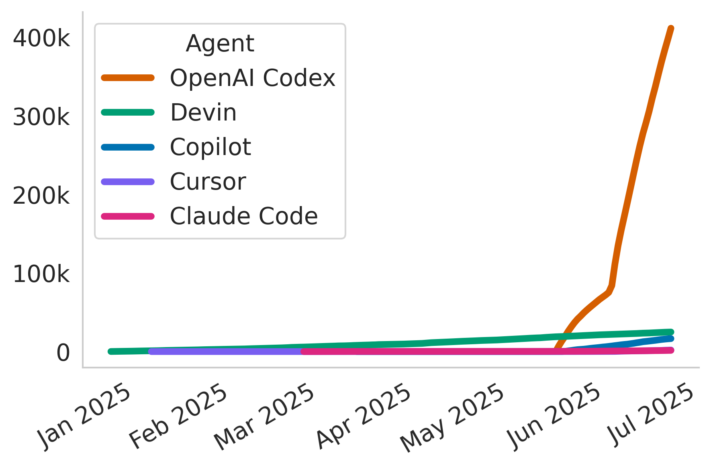
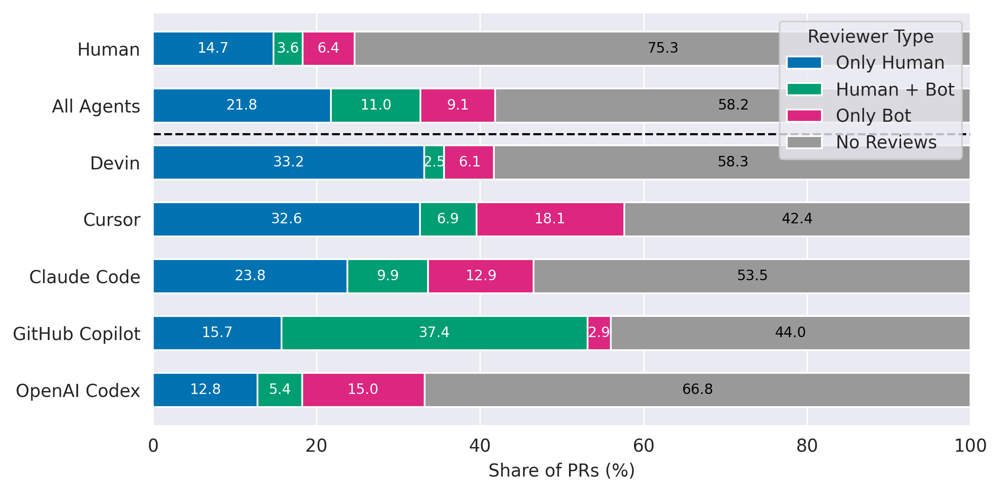
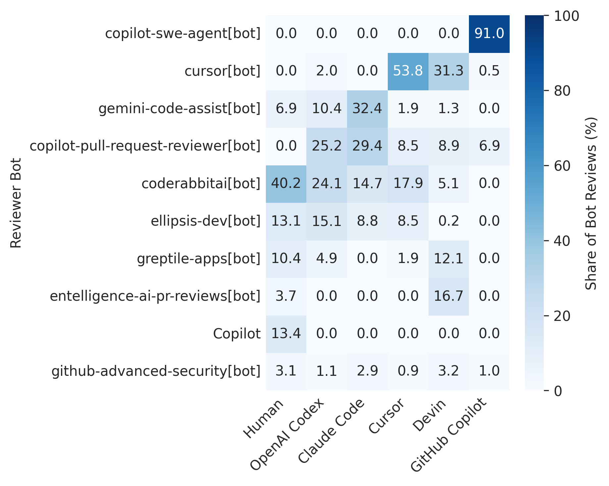

# The Rise of AI Teammates in Software Engineering (SE) 3.0: Replication Package

This repository contains the replication package for the paper "The Rise of AI Teammates in Software Engineering (SE) 3.0: How Autonomous Coding Agents Are Reshaping SE". Due to the size limit of GitHub repositories, the full dataset is not included here. You can find AIDev.zip [here](https://drive.google.com/file/d/12HYEa_4aEsCSi8Q1X-TkOHPiNUJW9FBF/view?usp=drive_link) for running the analysis scripts.

Submit the [Google Form](https://docs.google.com/forms/d/e/1FAIpQLSfXTmX9Az3t1WUrDQSxrIW1kPLLLAK7ANY4Sw7dBbZ2_XiW8A/viewform?usp=sharing&ouid=108962539638518204552) for requesting the full dataset.

## Overview



This study analyzes the impact of AI coding agents on software engineering practices by examining pull requests (PRs) from various AI teammates including GitHub Copilot, Cursor, Devin, Claude Code, and OpenAI Codex.

## Repository Structure

```
├── AIDev-pop/              # AIDev-pop subset of AIDev
├── analysis/              # Analysis scripts and Jupyter notebooks
├── figs/                  # Generated figures and results
├── requirements.txt       # Python dependencies
└── README.md             # This file
```

## Installation

Install required dependencies:

```bash
pip install -r requirements.txt
```

## Key Findings

### Productivity in Coding Agents Era


### Turnaround Time


### Who Review the PRs?





### Language Usage


## Citation

If you use this dataset or code in your research, please cite our paper:

```bibtex
@misc{li2025aiteammates,
      title={The Rise of AI Teammates in Software Engineering (SE) 3.0: How Autonomous Coding Agents Are Reshaping Software Engineering}, 
      author={Hao Li and Haoxiang Zhang and Ahmed E. Hassan},
      year={2025},
      eprint={2507.15003},
      archivePrefix={arXiv},
      primaryClass={cs.SE},
      url={https://arxiv.org/abs/2507.15003}, 
}
```
