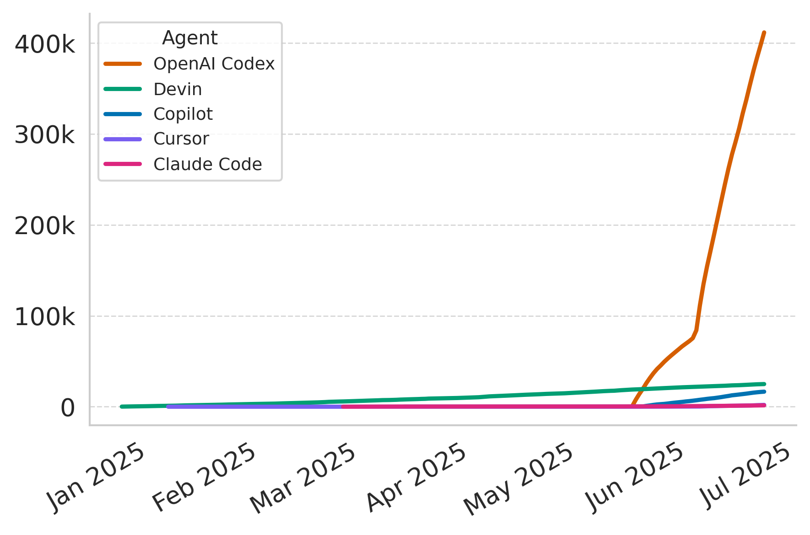

# The Rise of AI Teammates in Software Engineering (SE) 3.0: Replication Package

This repository contains the replication package for the paper "The Rise of AI Teammates in Software Engineering (SE) 3.0: How Autonomous Coding Agents Are Reshaping SE". Due to the size limit of GitHub repositories, the full dataset is not included here. You can find AIDev.zip [here](https://drive.google.com/file/d/12HYEa_4aEsCSi8Q1X-TkOHPiNUJW9FBF/view?usp=drive_link) for running the analysis scripts.

Submit the [Google Form](https://docs.google.com/forms/d/e/1FAIpQLSfXTmX9Az3t1WUrDQSxrIW1kPLLLAK7ANY4Sw7dBbZ2_XiW8A/viewform?usp=sharing&ouid=108962539638518204552) for requesting the full dataset.

## Overview

The overview of the AIDev dataset is as follows:

|           | #PR         | #Developer | #Repo      |
| --------- | ----------- | ---------- | ---------- |
| `OpenAI Codex`   | 411,621     | 41,619     | 53,702     |
| `Devin`   | 24,893      | 2,897      | 3,857      |
| `GitHub Copilot` | 16,531      | 1,916      | 3,097      |
| `Cursor`  | 1,981       | 753        | 828        |
| `Claude Code`  | 1,509       | 585        | 645        |
| **Total** | **456,535** | **47,303** | **61,453** |



## Repository Structure

```
├── AIDev-pop/              # AIDev-pop subset of AIDev
├── analysis/              # Analysis scripts and Jupyter notebooks
├── figs/                  # Generated figures and results
├── requirements.txt       # Python dependencies
└── README.md             # This file
```

## Installation

Install required dependencies:

```bash
pip install -r requirements.txt
```

## Key Findings

The key findings from the analysis of are based on AIDev-pop, a subset of the AIDev dataset.

### AIDev-pop: Filtered (>500 stars)

|           | #PR       | #Developer | #Repo   |
| --------- | --------- | ---------- | ------- |
| `OpenAI Codex`   | 2,686     | 522        | 467     |
| `Devin`   | 2,729     | 300        | 130     |
| `GitHub Copilot` | 1,462     | 309        | 215     |
| `Cursor`  | 144       | 66         | 52      |
| `Claude Code`  | 101       | 68         | 61      |
| **Total** | **7,122** | **1,240**  | **856** |


### Productivity in Coding Agents Era


### Turnaround Time


### Who Review the PRs?


### Language Usage


## Dataset Schema


## Citation

If you use this dataset or code in your research, please cite our paper:

```bibtex
@misc{li2025aiteammates,
      title={The Rise of AI Teammates in Software Engineering (SE) 3.0: How Autonomous Coding Agents Are Reshaping Software Engineering}, 
      author={Hao Li and Haoxiang Zhang and Ahmed E. Hassan},
      year={2025},
      eprint={2507.15003},
      archivePrefix={arXiv},
      primaryClass={cs.SE},
      url={https://arxiv.org/abs/2507.15003}, 
}
```
